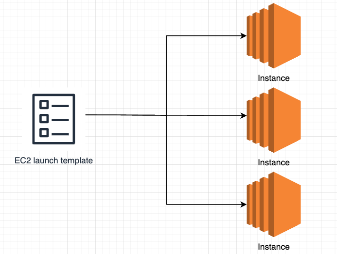
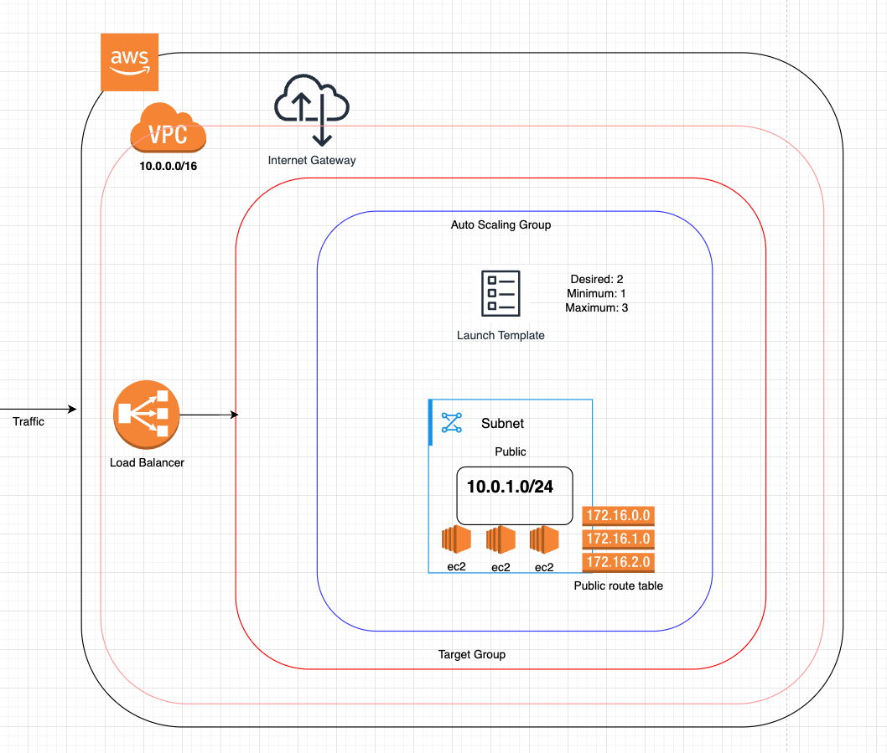
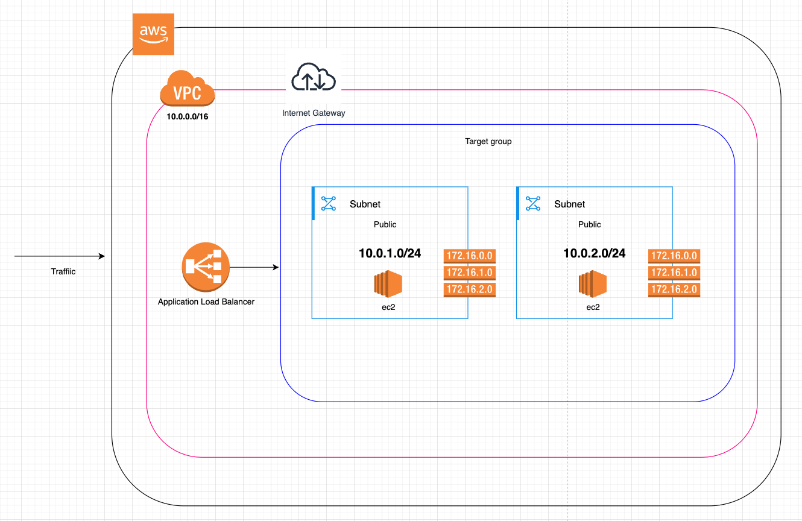
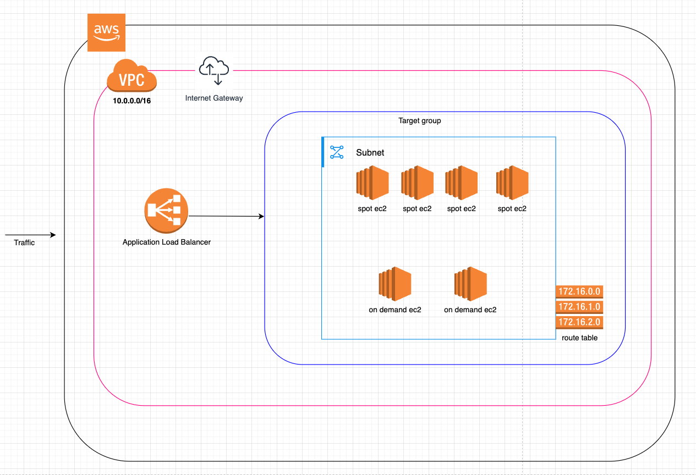

# Amazon EC2: Elastic Cloud Compute

Amazon Elastic Compute Cloud (EC2) is a web service that provides resizable compute capacity in the cloud. It is designed to make web-scale cloud computing easier for developers by allowing them to create virtual machines, or instances, that run on the AWS Cloud.

## Launching an EC2 Instance via AWS Console

### Step 1: Select a Name
- Choose a descriptive name for your instance to easily identify it later.

### Step 2: Select an AMI (Amazon Machine Image)
- An AMI provides the information required to launch an instance. Choose an AMI that suits your application needs.

### Step 3: Select Instance Type
- Choose an instance type based on the required CPU, memory, storage, and networking capacity.

### Step 4: Create a Key Pair
- A key pair is used to securely connect to your instance. Create a new key pair or use an existing one.
- Upon creating new key the public key will be associated to the instance and the private key will be downloaded
- You can go in the details of the instance and click on connect --> ssh section to get the details about how to connect to the instance using SSH

### Step 5: Configure Network Settings
- **VPC and Subnet**: Use the default VPC and subnet for simplicity.
- **Security Group Rules**:
  - Allow SSH access from anywhere (`0.0.0.0/0`) for remote management.
  - Allow HTTP access from anywhere (`0.0.0.0/0`) to serve web traffic.
- Ensure that "Auto-assign Public IP" is enabled to allow access from the public internet.

### Step 6: Configure Storage
- Select the default 8 GiB gp3 (General Purpose SSD) for storage.

### Step 7: Add User Data Script
- Use the following script to install Nginx and create a simple HTML page displaying the host IP:
  ```bash
  #!/bin/bash
  sudo apt-get update -y
  sudo apt-get install nginx -y
  cat <<EOF > /var/www/html/index.html
  <html>
    <head>
      <title>EC2 Instance Info</title>
    </head>
    <body>
      <h1>Welcome to EC2 Instance</h1>
      <p><strong>Hostname:</strong> $(hostname -f)</p>
    </body>
  </html>
  EOF
  sudo systemctl start nginx
  sudo systemctl enable nginx
  ```
- To troubleshoot any issues with the user data script, check the log file:
  ```bash
  tail -3000 /var/log/cloud-init-output.log
  ```

### Step 8: Launch the Instance
- Launch the instance and navigate to the instance details page.
- Copy the public DNS and open it in a web browser. You should see the Nginx welcome page with the host IP details.


### EC2 Instance Types

- [AWS Documentation](https://aws.amazon.com/ec2/instance-types/)
- This StackOverflow [post](https://stackoverflow.com/a/56880093) explain what does the instance letter means (unofficially ;-))

### T Type Instances

T class instances are among the most widely utilized EC2 instance types. The T2 generation is the older version, while T3 represents the latest generation. Their popularity stems from being the most cost-effective EC2 instances available. T3 instances utilize a credit-based system for CPU usage, which contributes to their affordability. These instances offer two performance modes: baseline and burst. Baseline performance refers to the consistent level of performance you can expect at all times, whereas burst performance indicates the enhanced performance available during periods of high demand. However, burst performance is constrained by the number of CPU credits allocated to the instance. You read [here](https://aws.amazon.com/ec2/instance-types/#Burstable_Performance_Instances) more about Burstable Performance Instances

You can read more about T3 Instances [here](https://aws.amazon.com/ec2/instance-types/t3/)

## VPC

AWS VPC (Virtual Private Cloud) is a fundamental service for constructing your cloud infrastructure on AWS. It offers a logically isolated virtual network that allows you to deploy your AWS resources, including Amazon EC2 instances, within a secure and scalable environment.

### Regions and availability zones

- To understand VPC first we need to understand AWS regions and availability zones. A region is a physical location around the world where AWS has data centers.
- Each region consists of multiple, isolated availability zones (physical data centers).
- An availability zone is one or more discrete data centers within a region, with independent power, cooling, and networking.
- A VPC is created within a specific region and cannot span multiple regions. For example If you create a VPC in us-east-1, it will only be available in the North Virginia region
- A VPC can span multiple AZs within the same region.


### Creating a VPC

1. In the AWS Management Console open the VPC console and click create VPC
2. Enter the name
3. IPv4 CIDR (Classless Inter-Domain Routing) use the following [tool](https://www.davidc.net/sites/default/subnets/subnets.html) to calculate the CIDR.
    - This defines in a VPC the IP address range available for your resources (like EC2 instances) in the VPC
    - It looks like 10.0.0.0/16 where:
        - 10.0.0.0 is the starting IP.
        - /16 defines the subnet mask, determining how many IPs are available
        - /16 = ~65,536 IPs.
        - /24 = 256 IPs.
    - 10.0.0.0/16 allows IPs from 10.0.0.0 to 10.0.255.255.
    - You can divide this range into smaller subnets, like 10.0.1.0/24 or 10.0.2.0/24
    - VPC CIDR blocks must come from the private IP ranges
        - 10.0.0.0/16 (CIDR block size must be between /16 and /28.)
        - 172.31.0.0/16 (CIDR block size must be between /16 and /28.)
        - 192.168.0.0/16 (CIDR block size must be between /16 and /28.)
        - Higher the postfix number (i.e. /16) smaller the range of IP addresses use this [tool](https://www.davidc.net/sites/default/subnets/subnets.html) for calculation
3. Click create VPC (Now a new VPC with the give CIDR is created in a AWS region)

The newly created VPC does not include any subnets. To begin utilizing this VPC, you will need to create subnets within it.

### Subnet

- Subnets are used to divide a VPC into smaller networks
- A subnet represents a specific range of IP addresses within your VPC. It allows you to deploy AWS resources, including Amazon EC2 instances, within that range. You can create multiple subnets within a single VPC.
- A subnet is confined to a single Availability Zone and cannot extend across multiple Availability Zones.
- Subnets can be public to allow traffic from internet (web servers)
- Subnets can also be private which does not allow internet traffic (DB Server)
- You can use NAT gateway to allow private subnets for outbound traffic
- Simply having a subnet does not mean that you can access the internet
- You need to create and configure route tables for that


#### Create a subnet

1. Click subnets from the VPC dashboard
2. Click create subnet
3. Select the previously created VPC
4. Enter the subnet name eg. aws-demo-subnet-public
5. Select Availability zone
6. Select IPv4 subnet CIDR block (same like VPC subnets also have CIDR block) set 10.0.1.0/24
    - The CIDR block of a subnet must be within the CIDR block of the VPC
    - You can’t have overlapping CIDR blocks in a VPC. For example, if you have a subnet with 192.168.1.0/24 CIDR block, you can’t have another subnet with 92.168.1.0/24 CIDR block in the same VPC
    - You can’t change the CIDR block of a subnet once it’s created. If you need to change the CIDR block, you’ll have to create a new subnet and migrate your resources to the new subnet
7. Create another private subnet
8. Set name to aws-demo-subnet-private
9. Select IPv4 subnet CIDR block set 10.0.2.0/24
10. Click create subnet

Important every new subnet CIDR start from the new number at the second digit of the IP like 10.0.1.0/24, 10.0.2.0/24, 10.0.3.0/24 and so on

Now the subnets are created inside the VPC:


### Internet Gateway

An Internet Gateway (IGW) is a component in AWS that enables resources within a VPC, such as EC2 instances, to communicate with the internet. It facilitates direct communication between public subnets in the VPC and the internet.


- create an Internet Gateway (IGW)
- attach to the VPC created above

Now we have the Internet Gateway (IGW) which is attached to our VPC. We need to create the route tables (public and private)

### Route Tables

Route Tables define how traffic flows within a VPC and outside it

Create public:

- Create a public route table from VPC Dashboard
- Select the above created VPC for this route table

Create private:

- Create a private route table from VPC Dashboard
- Select the above created VPC for this route table

####  Associate the public subnet

- Click on route tables from VPC dashboard
- Select public route table
- Select subnet association
- Edit and add public subnet association (select the above created public subnet)


####  Associate the private subnet

- Click on route tables from VPC dashboard
- Select private route table
- Select subnet association
- Edit and add private subnet association (select the above created private subnet)


#### Create a route for Internet Gateway

- Click on the route tables in VPC dashboard
- Click the above created public route table
- Click edit route
- Add the following route:
   0.0.0.0/0 (from anywhere) → IGW (the one which we created above)
- Internet Gateway route is two way from the i.e anyone can access the resources inside the subnet and all the resource inside the subnet can access the internet  

Now the resource (EC2) inside the public subnets will be accessible over public internet

#### NAT Gateway

NAT (Network Address Translation) Gateway allows instances in a private subnet to access the internet (e.g., for updates or API calls) without exposing them to inbound internet traffic

NAT is a one way communication i.e any resource inside private subnet can make request to the internet but not the other way around (suitable for updating and installing packages)

- Click on the NAT gateways in VPC dashboard
- Enter name
- Select the subnet
   - Important: NAT should be created in public subnet
- Set connectivity type to public
- Allocate Elastic IP
- Click create


#### Create a route for NAT Gateway

- Click on the route tables in VPC dashboard
- Click the above created private route table
- Click edit route
- Add the following route:
    0.0.0.0/0 (to anywhere) → NAT


#### Launching EC2 Instances

- launch EC2 Instances in public subnets which need public Internet access e.g Web Server
- launch EC2 Instance in private subnets which does not need Internet access (e.g., a database server that only needs to communicate with the application server in the public subnet)


All the above related to VPC, Subnets, Internet Gateway, Route Tables and NAT can be is shown in the diagram below:


#### Security Groups

Security Groups act as virtual firewalls for your EC2 instances to control inbound and outbound traffic. They are stateful, meaning if you allow an incoming request from a specific IP address and port, the response is automatically allowed regardless of outbound rules.

- By default, security groups allow all outbound traffic and deny all inbound traffic.
- You can add rules to allow specific inbound and outbound traffic based on IP address, port, and protocol.

#### Example: Creating a Security Group

1. Go to the EC2 dashboard
2. Click on "Security Groups" in the left-hand menu
3. Click "Create Security Group"
4. Enter a name and description for the security group
5. Select the VPC
6. Add inbound rules:
   - Type: HTTP, Protocol: TCP, Port Range: 80, Source: 0.0.0.0/0 (allows HTTP traffic from anywhere)
   - Type: SSH, Protocol: TCP, Port Range: 22, Source: <your-ip-address>/32 (allows SSH access only from your IP address)
7. Add outbound rules (if needed, otherwise all outbound traffic is allowed by default)
8. Click "Create"

#### Example: Inbound Rules

| Source            | Protocol | Port |
|-------------------|----------|------|
| 0.0.0.0/0         | TCP      | 80   |
| `<your-ip-address>/32` | TCP      | 22   |

#### Example: Outbound Rules

| Destination       | Protocol | Port |
|-------------------|----------|------|
| 0.0.0.0/0         | All      | All  |


#### Example: Associating a Security Group with an EC2 Instance

1. Launch an EC2 instance or select an existing instance
2. In the "Configure Security Group" step, select "Select an existing security group"
3. Choose the security group you created
4. Complete the instance launch process

By configuring security groups, you can control the traffic to and from your EC2 instances, enhancing the security of your applications and data.


### EC2 Launch Template

EC2 Launch Templates allow you to create pre-configured EC2 instance configurations that can be reused to launch instances quickly and consistently. Launch templates can include details such as the AMI ID, instance type, key pair, security groups, and user data.




#### Example: Creating an EC2 Launch Template

1. Go to the EC2 dashboard
2. Click on "Launch Templates" in the left-hand menu
3. Click "Create launch template"
4. Enter a name and description for the launch template (e.g., `ec2-with-nginx`)
5. Under "Launch template contents", configure the following settings:
   - AMI ID: Select an appropriate Amazon Machine Image (AMI) for your instance
   - Instance type: Choose the instance type (e.g., t2.micro)
   - Key pair: Select an existing key pair or create a new one
   - Security groups: Select the security group you created with HTTP (port 80) and SSH (port 22) rules
   - Make sure to select Auto-assign public IP as enable
   - User data: Enter the following user data script to install Nginx on the instance:
     ```bash
     #!/bin/bash
     sudo apt-get update -y
     sudo apt-get install nginx -y
     cat <<EOF > /var/www/html/index.html
     <html>
       <head>
         <title>EC2 Instance Info</title>
       </head>
       <body>
         <h1>Welcome to EC2 Instance</h1>
         <p><strong>Hostname:</strong> $(hostname -f)</p>
       </body>
     </html>
     EOF
     sudo systemctl start nginx
     sudo systemctl enable nginx
     ```
6. Configure any additional settings as needed (e.g., storage, network interfaces)
7. Click "Create launch template"

By creating an EC2 launch template, you can easily launch instances with the same configuration, ensuring consistency and saving time.

### Example: Launching an EC2 Instance from a Launch Template

1. Go to the EC2 dashboard
2. Click on "Launch Templates" in the left-hand menu
3. Select the launch template you created (e.g., `ec2-with-nginx`)
4. Click "Actions" and select "Launch instance from template"
5. Configure any additional settings as needed
6. Click "Launch instance"

Using launch templates, you can streamline the process of launching EC2 instances with predefined configurations, making it easier to manage and scale your infrastructure.

You can also create a new launch template based on an existing one by selecting the source template during the creation process. For example, you can create a new template `ec2-with-nginx-and-docker` from the `ec2-with-nginx` template. Simply modify the user data script to include the commands for installing Docker.

### Auto Scaling

Auto Scaling is a cloud computing feature that automatically adjusts the number of active instances in a service based on current demand. It helps maintain application performance and availability by scaling out (adding instances) during high traffic periods and scaling in (removing instances) during low traffic periods, ensuring efficient resource utilization and cost management.

Let's implement a auto scaling on AWS

1. Create a VPC
2. Create Internet Gateway
3. Attache the created Internet Gateway to the VPC
4. Create subnets (create two subnets in different availability zone for high availability)
5. Create route table
6. Associate route table to the above created 2 subnets
7. Create a route for Internet Gateway inside the above created route table
    - 0.0.0.0/0 (from anywhere) → IGW (the one which we created above)
8. Create a target group
    - A target group is used to route requests to one or more registered targets (such as EC2 instances) when using a load balancer. It allows you to configure health checks, specify the protocol and port for routing, and manage the targets that receive traffic.
    - Go to the EC2 dashboard
    - Click on "Target Groups" in the left-hand menu
    - Click "Create target group"
    - Set the target type to "Instances"
    - Set the protocol to "HTTP" and the port to "80"
    - Set the VPC to the one you created earlier
    - Click "Next"
    - Skip the "Register targets" step for now (we will register targets later)
    - Click "Create target group"
9. Create Loud Balancer
   - click on load balancer in EC2 Dashboard
   - click Application Load Balance
   - click create
   - enter name
   - select Internet facing
   - IP type as IPv4
   - select the above created VPC
   - map bot the subnets created above in the difference zones
   - create a security group in the above created VPC with ssh and http inbound rules
   - add a listener for http on port 80 and set target to the above created target group
    
        | Protocol | Port | Target Group |
        |----------|------|--------------|
        | HTTP     | 80   | YourTargetGroupName |
    
    - click create load balancer

10. Create auto scaling group
    Auto Scaling Groups (ASGs) are a feature in Amazon EC2 that automatically manage the scaling of your instances. They ensure that you have the right number of Amazon EC2 instances available to handle the load for your application. ASGs can automatically increase the number of instances during demand spikes to maintain performance and decrease capacity during lulls to reduce costs.
    - select auto scaling group from EC2 dashboard
    - click create
    - set a name
    - create a launch template
      - follow the steps from above for creating a security group
      - make sure to add the Security groups created in the above step of creating a load balancer
      - make sure not to select a subnet
      - make sure to enable auto assign public IP
      - Add the use data script from above to Install NGINX
      - create template
    - now select the newly created launch template 
    - click next and select the VPC created in step 1 and select subnets created in step 2
    - click next and select attach existing load balancer
    - click Choose from your load balancer target groups
    - select the target group created in step 8
    - enable health checks
    - click next and add scaling options:
        Desired capacity: 2
        // This is the number of EC2 instances that the Auto Scaling group should maintain at all times. Setting this to 2 means that the system will try to keep 2 instances running to handle the application load.

        Min desired capacity: 1
        // This is the minimum number of instances that the Auto Scaling group will maintain. If the load decreases, the system will not scale down below this number, ensuring that at least one instance is always available to handle requests.

        Max desired capacity: 3
        // This is the maximum number of instances that the Auto Scaling group can scale up to. If the demand increases, the system can add instances up to this limit, allowing for flexibility in handling varying loads without exceeding resource limits.
        - The can be more fine tuning done, but for now we can keep the default options 
    - click next and review the selection and click create
11. Now go to your load balancer and copy the public DNS
12. Open the URL in the browser
13. On refreshing you should see different EC2 Instance ip in the response
14. You can go to auto scaling group, select the group and click "Instance Management"
15. You can see the health of the instance

#### Verify the auto scaling

Just remove an instance from the the EC2 Dashboard which is launched using the above target group
The Auto scaling will automatically provision a new EC2 instance to fulfill the minimum of 2 scaling

Here is the diagram showing the above implemented auto scaling:




### Load balancer without Auto Scaling (Fixed number of EC2 Instances with load balancing)

1. Create a VPC
2. Create Internet Gateway
3. Attache the created Internet Gateway to the VPC
4. Create subnets (create two subnets in different availability zone for high availability)
5. Create route table
6. Associate route table to the above created 2 subnets
7. Create a route for Internet Gateway inside the above created route table
    - 0.0.0.0/0 (from anywhere) → IGW (the one which we created above)
8. Create a target group
    - A target group is used to route requests to one or more registered targets (such as EC2 instances) when using a load balancer. It allows you to configure health checks, specify the protocol and port for routing, and manage the targets that receive traffic.
    - Go to the EC2 dashboard
    - Click on "Target Groups" in the left-hand menu
    - Click "Create target group"
    - Set the target type to "Instances"
    - Set the protocol to "HTTP" and the port to "80"
    - Set the VPC to the one you created earlier
    - Click "Next"
    - Skip the "Register targets" step for now (we will register targets later)
    - Click "Create target group"
9. Create Loud Balancer
   - click on load balancer in EC2 Dashboard
   - click Application Load Balance
   - click create
   - enter name
   - select Internet facing
   - IP type as IPv4
   - select the above created VPC
   - map bot the subnets created above in the difference zones
   - create a security group in the above created VPC with ssh and http inbound rules
   - add a listener for http on port 80 and set target to the above created target group
    
        | Protocol | Port | Target Group |
        |----------|------|--------------|
        | HTTP     | 80   | YourTargetGroupName |
    
    - click create load balancer
10. Launch EC instances and register them in the above created target group
11. Now go to your load balancer and copy the public DNS
12. Open the URL in the browser
13. On refreshing you should see different EC2 Instance ip in the response

Here is the architectural diagram of the above setup:




### EC2 Spot Instances

EC2 Spot Instances are a type of Amazon EC2 instance that allows you to take advantage of unused EC2 capacity in the AWS cloud at significantly reduced costs. Spot Instances are available for up to 90% off the on-demand price, making them an attractive option for cost-sensitive workloads.

AWS provides a two-minute warning before terminating Spot Instances (when requested by someone else as on demand instances), allowing you to handle the interruption gracefully.

#### Combining on demand and spot EC2 Instances

For maximum availability while optimizing costs, you can combine On-Demand and Spot instances behind a load balancer. A recommended approach is to maintain a base capacity of On-Demand instances (e.g., 60%) to handle your steady-state traffic, while using Spot instances (e.g., 40%) to handle variable loads and scale cost-effectively. This hybrid setup works well for applications that can handle instance interruptions, like web servers, batch processing, or containerized workloads. However, avoid using Spot instances for critical stateful applications, databases, or workloads requiring consistent performance. The load balancer automatically routes traffic away from terminated Spot instances, ensuring service continuity.

#### Load balancer with combination of on demand and spot EC2 Instances

1. Create a VPC
2. Create Internet Gateway
3. Attache the created Internet Gateway to the VPC
4. Create subnets (create two subnets in different availability zone for high availability) you can create more for hight availability
5. Create route table
6. Associate route table to the above created 2 subnets
7. Create a route for Internet Gateway inside the above created route table
    - 0.0.0.0/0 (from anywhere) → IGW (the one which we created above)
9. create a security group in the above created VPC with ssh and http inbound rules  
8. Create a EC2 Instance launch template for spot instances
    1. Go to the EC2 dashboard
    2. Click on "Launch Templates" in the left-hand menu
    3. Click "Create launch template"
    4. Enter a name and description for the launch template (e.g., `ec2-with-nginx`)
    5. Under "Launch template contents", configure the following settings:
        - AMI ID: Select an appropriate Amazon Machine Image (AMI) for your instance
        - Instance type: Choose the instance type (e.g., t2.micro)
        - Key pair: Select an existing key pair or create a new one
        - Security groups: Select the security group you created with HTTP (port 80) and SSH (port 22) rules
        - Make sure to select Auto-assign public IP as enable
        - User data: Enter the following user data script to install Nginx on the instance:
            ```bash
            #!/bin/bash
            sudo apt-get update -y
            sudo apt-get install nginx -y
            cat <<EOF > /var/www/html/index.html
            <html>
            <head>
                <title>EC2 Instance Info</title>
            </head>
            <body>
                <h1>Welcome to EC2 Instance</h1>
                <p><strong>Spot Instance Hostname:</strong> $(hostname -f)</p>
            </body>
            </html>
            EOF
            sudo systemctl start nginx
            sudo systemctl enable nginx
            ```
    6. Configure any additional settings as needed (e.g., storage, network interfaces)
    7. Click "Create launch template"
9. Go to spot requests from EC2 Dashboard and request let's say 4 spot instances fleet (use the configuration which suites you use case)
10. Create two EC2 On demand instances with the also the above user data command (change the paragraph with on demand instead of Spot Instance)
11. Create a target group
    - A target group is used to route requests to one or more registered targets (such as EC2 instances) when using a load balancer. It allows you to configure health checks, specify the protocol and port for routing, and manage the targets that receive traffic.
    - Go to the EC2 dashboard
    - Click on "Target Groups" in the left-hand menu
    - Click "Create target group"
    - Set the target type to "Instances"
    - Set the protocol to "HTTP" and the port to "80"
    - Set the VPC to the one you created earlier
    - Click "Next"
    - Skip the "Register targets" step for now (we will register targets later)
    - Click "Create target group"
12. Create Loud Balancer
   - click on load balancer in EC2 Dashboard
   - click Application Load Balance
   - click create
   - enter name
   - select Internet facing
   - IP type as IPv4
   - select the above created VPC
   - map bot the subnets created above in the difference zones
   - create a security group in the above created VPC with ssh and http inbound rules
   - add a listener for http on port 80 and set target to the above created target group
        | Protocol | Port | Target Group |
        |----------|------|--------------|
        | HTTP     | 80   | YourTargetGroupName |

   - click create load balancer
13. Now go to your load balancer and copy the public DNS
14. Open the URL in the browser
15. On refreshing you should see different EC2 Instance ip in the response (sometimes spot instance and sometime on demand instances)
  
Here is the architectural diagram of the above setup:



### EC2 EBS Volume

EBS (Elastic Block Store) volumes are block-level storage devices that can be attached to EC2 instances. They provide persistent storage that remains available even after the instance is stopped or terminated. EBS volumes are used for a variety of purposes, including storing data, databases, and application files.

There are two main types EBS volumes gp and io

| EBS Type     | Performance                                      | Cost                                         |
|-------------|--------------------------------------------------|----------------------------------------------|
| General Purpose (gp) | Good price and performance. Works for many workloads. | Usually cheaper. Good for most applications. |
| Provisioned IOPS (io) | Designed for I/O-intensive apps needing high performance and low latency. | More expensive due to provisioned IOPS for consistent performance. |

You can read more about them [here](https://docs.aws.amazon.com/ebs/latest/userguide/ebs-volume-types.html)

Choosing the correct type for use case depends on the Throughput and I/O of your application use case. You can read this interesting [StackOverflow](https://stackoverflow.com/a/61795555) to under understand the difference between Throughput and I/O

#### how to create EBS Volume and attach to EC2 Instance

1. Launch a new EC2 instance
2. Go to EC2 Dashboard and click on volumes under Elastic Block Store
3. Click create volume
4. Select your preferences (make sure to create the volume in the same availability zone where your EC2 instance is running otherwise you can not attach the volume to the EC2 Instance)
5. Now select the newly created volume and click action and then attach
6. Select instance and device name


You can verify that the volume is attached by doing this:
- ssh to the EC2 container
- run the command `lsblk`

This volume is attached but not useable yet, we need to make it useable, follow these steps:

List the disk partitions:

```
sudo fdisk -l
```

Check the file system (you will not see any file system)

```
sudo lsblk -f /dev/xvdk
```

Create the file system:

```
sudo mkfs -t xfs /dev/xvdk
```

Now confirm the file system:

```
sudo lsblk -f /dev/xvdk
```

you will see the filesystem xfs

Create a directory to mount:

```
sudo mkdir /demo-ebs-volume
```

Mount the volume to the path:

```
sudo mount /dev/xvdk /demo-ebs-volume
```

confirm:

```
df -h
```


#### increase volume size

-  Go to EC2 Dashboard and clicking on volumes under Elastic Block Store
- Select you volume and click modify
- Increase size
- Click apply

It will take a few minutes and the size will be increased

IMPORTANT: You can only increase size and not decrease the size of the EBS volume

Verify the increased size:


```
sudo fdisk -l
```

#### EBS Snapshots

- An EBS snapshot is a backup of your EBS volume that is stored in Amazon S3. Snapshots are incremental backups, meaning that only the blocks that have changed since the last snapshot are saved, which helps to save storage space and reduce costs.
- To create a snapshot, go to the EC2 Dashboard, click on "Volumes" under Elastic Block Store, select the volume you want to back up, and then click on "Create Snapshot."
- You can also automate snapshot creation using AWS Lambda or AWS Backup for regular backups.
- Snapshots can be used to create new EBS volumes (go to snapshots and click the action create volume from the snapshot), allowing you to restore data or create copies of your existing volumes.
- Volumes created from snapshots have already the filesystem and you just need to mount them
- Keep in mind that while snapshots are stored in S3, they are not directly accessible like regular S3 objects. You can only use them to create new EBS volumes or restore existing ones.

#### Important Considerations
- Snapshots are charged based on the amount of data stored in S3, so it's important to manage them effectively.
- You can also share snapshots with other AWS accounts or make them public, but be cautious with sensitive data.


