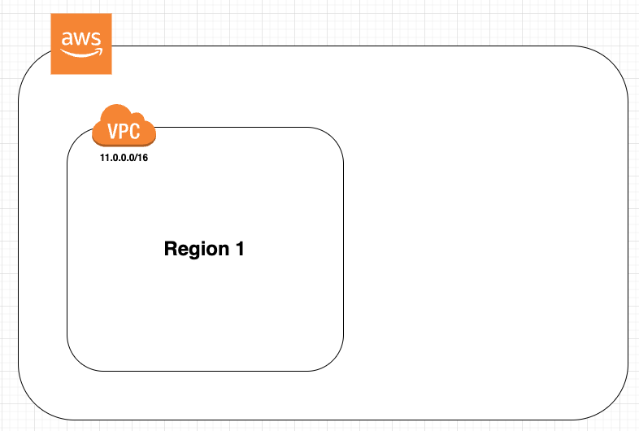
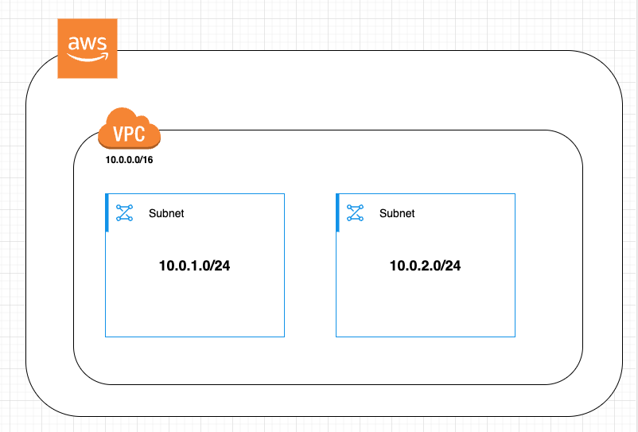
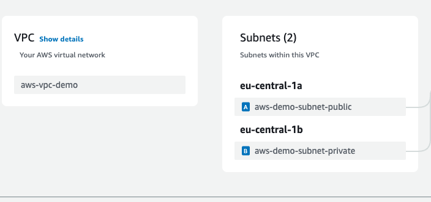
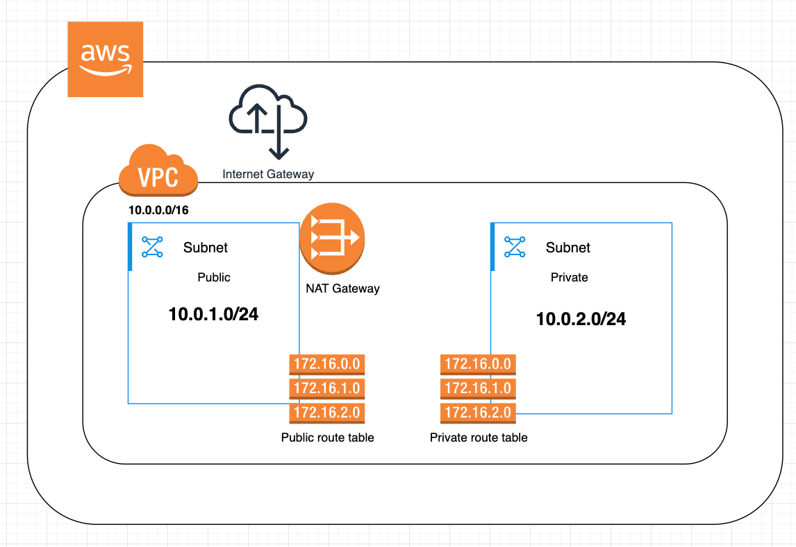

# Amazon EC2: Elastic Cloud Compute

Amazon Elastic Compute Cloud (EC2) is a web service that provides resizable compute capacity in the cloud. It is designed to make web-scale cloud computing easier for developers by allowing them to create virtual machines, or instances, that run on the AWS Cloud.

## Launching an EC2 Instance via AWS Console

### Step 1: Select a Name
- Choose a descriptive name for your instance to easily identify it later.

### Step 2: Select an AMI (Amazon Machine Image)
- An AMI provides the information required to launch an instance. Choose an AMI that suits your application needs.

### Step 3: Select Instance Type
- Choose an instance type based on the required CPU, memory, storage, and networking capacity.

### Step 4: Create a Key Pair
- A key pair is used to securely connect to your instance. Create a new key pair or use an existing one.
- Upon creating new key the public key will be associated to the instance and the private key will be downloaded
- You can go in the details of the instance and click on connect --> ssh section to get the details about how to connect to the instance using SSH

### Step 5: Configure Network Settings
- **VPC and Subnet**: Use the default VPC and subnet for simplicity.
- **Security Group Rules**:
  - Allow SSH access from anywhere (`0.0.0.0/0`) for remote management.
  - Allow HTTP access from anywhere (`0.0.0.0/0`) to serve web traffic.
- Ensure that "Auto-assign Public IP" is enabled to allow access from the public internet.

### Step 6: Configure Storage
- Select the default 8 GiB gp3 (General Purpose SSD) for storage.

### Step 7: Add User Data Script
- Use the following script to install Nginx and create a simple HTML page displaying the host IP:
  ```bash
  #!/bin/bash
  sudo apt-get update -y
  sudo apt-get install nginx -y
  cat <<EOF > /var/www/html/index.html
  <html>
    <head>
      <title>EC2 Instance Info</title>
    </head>
    <body>
      <h1>Welcome to EC2 Instance</h1>
      <p><strong>Hostname:</strong> $(hostname -f)</p>
    </body>
  </html>
  EOF
  sudo systemctl start nginx
  sudo systemctl enable nginx
  ```
- To troubleshoot any issues with the user data script, check the log file:
  ```bash
  tail -3000 /var/log/cloud-init-output.log
  ```

### Step 8: Launch the Instance
- Launch the instance and navigate to the instance details page.
- Copy the public DNS and open it in a web browser. You should see the Nginx welcome page with the host IP details.


### EC2 Instance Types

- [AWS Documentation](https://aws.amazon.com/ec2/instance-types/)
- This StackOverflow [post](https://stackoverflow.com/a/56880093) explain what does the instance letter means (unofficially ;-))

### T Type Instances

T class instances are among the most widely utilized EC2 instance types. The T2 generation is the older version, while T3 represents the latest generation. Their popularity stems from being the most cost-effective EC2 instances available. T3 instances utilize a credit-based system for CPU usage, which contributes to their affordability. These instances offer two performance modes: baseline and burst. Baseline performance refers to the consistent level of performance you can expect at all times, whereas burst performance indicates the enhanced performance available during periods of high demand. However, burst performance is constrained by the number of CPU credits allocated to the instance. You read [here](https://aws.amazon.com/ec2/instance-types/#Burstable_Performance_Instances) more about Burstable Performance Instances

You can read more about T3 Instances [here](https://aws.amazon.com/ec2/instance-types/t3/)

## VPC

AWS VPC (Virtual Private Cloud) is a fundamental service for constructing your cloud infrastructure on AWS. It offers a logically isolated virtual network that allows you to deploy your AWS resources, including Amazon EC2 instances, within a secure and scalable environment.

### Regions and availability zones

- To understand VPC first we need to understand AWS regions and availability zones. A region is a physical location around the world where AWS has data centers.
- Each region consists of multiple, isolated availability zones (physical data centers).
- An availability zone is one or more discrete data centers within a region, with independent power, cooling, and networking.
- A VPC is created within a specific region and cannot span multiple regions. For example If you create a VPC in us-east-1, it will only be available in the North Virginia region
- A VPC can span multiple AZs within the same region.





### Creating a VPC

1. In the AWS Management Console open the VPC console and click create VPC
2. Enter the name
3. IPv4 CIDR (Classless Inter-Domain Routing) use the following [tool](https://www.davidc.net/sites/default/subnets/subnets.html) to calculate the CIDR.
    - This defines in a VPC the IP address range available for your resources (like EC2 instances) in the VPC
    - It looks like 10.0.0.0/16 where:
        - 10.0.0.0 is the starting IP.
        - /16 defines the subnet mask, determining how many IPs are available
        - /16 = ~65,536 IPs.
        - /24 = 256 IPs.
    - 10.0.0.0/16 allows IPs from 10.0.0.0 to 10.0.255.255.
    - You can divide this range into smaller subnets, like 10.0.1.0/24 or 10.0.2.0/24
    - VPC CIDR blocks must come from the private IP ranges
        - 10.0.0.0/16 (CIDR block size must be between /16 and /28.)
        - 172.31.0.0/16 (CIDR block size must be between /16 and /28.)
        - 192.168.0.0/16 (CIDR block size must be between /16 and /28.)
        - Higher the postfix number (i.e. /16) smaller the range of IP addresses use this [tool](https://www.davidc.net/sites/default/subnets/subnets.html) for calculation
3. Click create VPC (Now a new VPC with the give CIDR is created in a AWS region)

The newly created VPC does not include any subnets. To begin utilizing this VPC, you will need to create subnets within it.

### Subnet

- Subnets are used to divide a VPC into smaller networks
- A subnet represents a specific range of IP addresses within your VPC. It allows you to deploy AWS resources, including Amazon EC2 instances, within that range. You can create multiple subnets within a single VPC.
- A subnet is confined to a single Availability Zone and cannot extend across multiple Availability Zones.
- Subnets can be public to allow traffic from internet (web servers)
- Subnets can also be private which does not allow internet traffic (DB Server)
- You can use NAT gateway to allow private subnets for outbound traffic
- Simply having a subnet does not mean that you can access the internet
- You need to create and configure route tables for that




#### Create a subnet

1. Click subnets from the VPC dashboard
2. Click create subnet
3. Select the previously created VPC
4. Enter the subnet name eg. aws-demo-subnet-public
5. Select Availability zone
6. Select IPv4 subnet CIDR block (same like VPC subnets also have CIDR block) set 10.0.1.0/24
    - The CIDR block of a subnet must be within the CIDR block of the VPC
    - You can’t have overlapping CIDR blocks in a VPC. For example, if you have a subnet with 192.168.1.0/24 CIDR block, you can’t have another subnet with 92.168.1.0/24 CIDR block in the same VPC
    - You can’t change the CIDR block of a subnet once it’s created. If you need to change the CIDR block, you’ll have to create a new subnet and migrate your resources to the new subnet
7. Create another private subnet
8. Set name to aws-demo-subnet-private
9. Select IPv4 subnet CIDR block set 10.0.2.0/24
10. Click create subnet

Important every new subnet CIDR start from the new number at the second digit of the IP like 10.0.1.0/24, 10.0.2.0/24, 10.0.3.0/24 and so on

Now the subnets are created inside the VPC:



### Internet Gateway

An Internet Gateway (IGW) is a component in AWS that enables resources within a VPC, such as EC2 instances, to communicate with the internet. It facilitates direct communication between public subnets in the VPC and the internet.


- create an Internet Gateway (IGW)
- attach to the VPC created above

Now we have the Internet Gateway (IGW) which is attached to our VPC. We need to create the route tables (public and private)

### Route Tables

Route Tables define how traffic flows within a VPC and outside it

Create public:

- Create a public route table from VPC Dashboard
- Select the above created VPC for this route table

Create private:

- Create a private route table from VPC Dashboard
- Select the above created VPC for this route table

####  Associate the public subnet

- Click on route tables from VPC dashboard
- Select public route table
- Select subnet association
- Edit and add public subnet association (select the above created public subnet)


####  Associate the private subnet

- Click on route tables from VPC dashboard
- Select private route table
- Select subnet association
- Edit and add private subnet association (select the above created private subnet)


#### Create a route for Internet Gateway

- Click on the route tables in VPC dashboard
- Click the above created public route table
- Click edit route
- Add the following route:
   0.0.0.0/0 (from anywhere) → IGW (the one which we created above)
- Internet Gateway route is two way from the i.e anyone can access the resources inside the subnet and all the resource inside the subnet can access the internet  

Now the resource (EC2) inside the public subnets will be accessible over public internet

#### NAT Gateway

NAT (Network Address Translation) Gateway allows instances in a private subnet to access the internet (e.g., for updates or API calls) without exposing them to inbound internet traffic

NAT is a one way communication i.e any resource inside private subnet can make request to the internet but not the other way around (suitable for updating and installing packages)

- Click on the NAT gateways in VPC dashboard
- Enter name
- Select the subnet
   - Important: NAT should be created in public subnet
- Set connectivity type to public
- Allocate Elastic IP
- Click create


#### Create a route for NAT Gateway

- Click on the route tables in VPC dashboard
- Click the above created private route table
- Click edit route
- Add the following route:
    0.0.0.0/0 (to anywhere) → NAT


#### Launching EC2 Instances

- launch EC2 Instances in public subnets which need public Internet access e.g Web Server
- launch EC2 Instance in private subnets which does not need Internet access (e.g., a database server that only needs to communicate with the application server in the public subnet)


All the above related to VPC, Subnets, Internet Gateway, Route Tables and NAT can be is shown in the diagram below:

