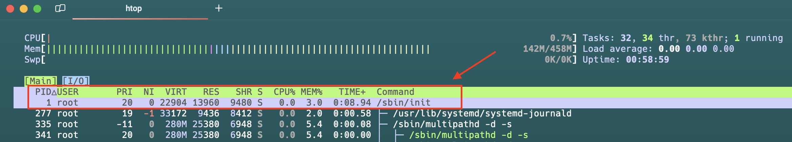

# Systemd

## Init Process

The init process is the first process started by the Linux kernel, serving as the foundation for all other processes. It launches necessary processes to bring the system to a functional state and manages their starting, stopping, and safe termination during shutdown.


In older Linux versions, the init process was a shell script. Most modern distros now use systemd, a binary program that enhances performance and simplifies service management. Systemd utilizes unit files for service management and offers features like parallel startup, socket activation, and on-demand launching, along with log management. Essentially, systemd is a comprehensive suite of tools.

## The parent process

If you run the `htop` command in Linux terminal and then press `t` you will see the tree view and can see which process is running under which process.




The top process, with PID 1, is `/sbin/init`, the first process started during boot. All other processes branch underneath it in the tree view.

If you check the `/sbin/init` it is a symlinks to `/lib/systemd/system`. systemd is running all of our processes

```
ls -la /sbin/init | grep init
lrwxrwxrwx 1 root root 22 Oct  4 15:37 /sbin/init -> ../lib/systemd/systemd
```

## Systemd Units

In Linux, long-running processes are often called services or daemons, but systemd refers to them as units. A unit can be a service, socket, mount, or target managed by systemd.

Units are defined in unit files, which are configuration files that specify a unit's behavior, dependencies, startup conditions, and settings for systemd management.


### Custom System Unit Files 👉 `/etc/systemd/system/`

Administrators can create custom unit files in this directory to define or modify services, overriding default settings.

### Standard Unit Files 👉 `/lib/systemd/system/`

Unit files for system-wide services, typically preinstalled and managed by the distribution maintainers.

### Installed Package Unit Files 👉 `/usr/lib/systemd/system`

This is where package managers place unit files for installed packages, such as those created by nginx during installation.

## Creating Your Own Systemd Unit

Create the Shell Script

```
sudo vi /usr/local/bin/dummy-logger.sh
```

```
#!/bin/bash

# Log file location
LOG_FILE="/var/log/dummy-data.log"

# Create log file if it doesn't exist
touch "$LOG_FILE"

# Write timestamp and random number to log file
echo "$(date): Random Number - $RANDOM" >> "$LOG_FILE"
```

Create a systemd Service File

```
sudo vi /etc/systemd/system/dummy-logger.service
```

```
[Unit]
Description=Dummy Logger Service
After=network.target

[Service]
Type=oneshot
ExecStart=/usr/local/bin/dummy-logger.sh

[Install]
WantedBy=multi-user.target
```

### Explanation of Each Line in the Service File

#### [Unit] Section
- **Description**: A brief description of the service.
- **After**: Specifies that this service should start after the network is up.

#### [Service] Section
- **Type**: Defines the service type; 'oneshot' means it runs a single task and then exits.
- **ExecStart**: The command that will be executed when the service starts.

#### [Install] Section
- **WantedBy**: Indicates the target that this service should be started under; 'multi-user.target' is a common target for services.


This service will run our logging script once. Now, let’s set up a timer to run it every 10 seconds.

```
sudo vi /etc/systemd/system/dummy-logger.timer
```

```
[Unit]
Description=Run Dummy Logger Service every 10 seconds

[Timer]
OnBootSec=10s
OnUnitActiveSec=10s
Unit=dummy-logger.service

[Install]
WantedBy=timers.target
````

#### Explanation of each line in the timer file

#### [Unit] section
- **Description**: A brief description of the timer.

#### [Timer] section
- **OnBootSec**: Specifies the delay before the timer starts after booting.
- **OnUnitActiveSec**: Specifies the interval at which the timer will trigger the associated service.
- **Unit**: The name of the service that this timer will activate.

#### [Install] section
- **WantedBy**: Indicates the target that this timer should be started under; 'timers.target' is used for timer units.

Enable and start the timer, which will, in turn, trigger the service every 10 seconds

````
sudo systemctl daemon-reload
sudo systemctl enable dummy-logger.timer
sudo systemctl start dummy-logger.timer
````

After a few seconds, check the log file to see if the dummy data is being logged

````
cat /var/log/dummy-data.log
````

### Journalctl

When systemd oversees a service unit, it automatically logs its standard output and standard error streams into the journal. Consequently, any log messages or output produced by the service are recorded and can be accessed using the `journalctl` command.

Following command can be used to view the logs:

```
journalctl -u <service-name>
```

## Mostly used commands

Start a service:

```
sudo systemctl start <service-name>
```

Stop a service:

```
sudo systemctl stop <service-name>
```

Restart a serive:

```
sudo systemctl restart <service-name>
```

Reload a Service Configuration (without full restart)

```
sudo systemctl reload <service-name>
```

Enable a service:

```
sudo systemctl enable <service-name>
```

Disable a service:

```
sudo systemctl disable <service-name>
```

Check if a service is enabled:

```
systemctl is-enabled <service-name>
```

Check status

```
systemctl status <service-name>
```

View logs of a service:

```
journalctl -u <service-name>
```


Show active services:

```
systemctl list-units --type=service --state=running
```
